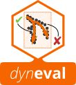
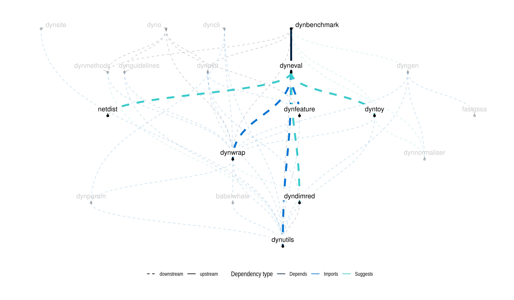

<!-- README.md is generated from README.Rmd. Please edit that file -->

```{r setup, echo = FALSE}
knitr::opts_chunk$set(warning = FALSE, message = FALSE, error = FALSE, echo = FALSE)
```

```{r}
library(tidyverse)
library(dyneval)
```

<a href="https://travis-ci.org/dynverse/dyneval"></a> <a href="https://codecov.io/gh/dynverse/dyneval"> </a>  [**ℹ️ Tutorials**](https://dynverse.org)  &nbsp;  &nbsp; [**ℹ️ Reference documentation**](https://dynverse.org/reference/dyneval) <br>

# Metrics to compare two trajectories

This R package implements several metrics for comparing two single-cell trajectories.

These include:

- **Specific metrics**, metrics which look at the similarity of a specific part of the trajectory, such as the topology or the cellular ordering

```{r}
metrics %>% 
  filter(type == "specific") %>%
  select(Name = html, `Long name`= long_name, Category = category) %>% 
  knitr::kable()
```

- **Application metrics**, which assess the accuracy of some downstream analyses of trajectories

```{r}
metrics %>% 
  filter(type == "application") %>%
  select(Name = html, `Long name`= long_name) %>% 
  knitr::kable()
```

- **Overall metrics**, which combine several specific and/or application metrics to analyse the overall similarity of two trajectories

```{r}
metrics %>% 
  filter(type == "overall") %>%
  select(Name = html, `Long name`= long_name) %>% 
  knitr::kable()
```


## Latest changes

Check out `news(package = "dyneval")` or [NEWS.md](inst/NEWS.md) for a full list of changes.

<!-- This section gets automatically generated from inst/NEWS.md, and also generates inst/NEWS -->

```{r news, echo=FALSE, results="asis"}
dynutils::update_news()
cat(dynutils::recent_news())
```

## Dynverse dependencies

<!-- Generated by "update_dependency_graphs.R" in the main dynverse repo -->

